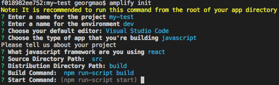

## Step 0: Prereqs

1. [Install Node](https://nodejs.org/en/download/) for your OS. Use Node 10 or newer.
2. Install npx for Node. npx is a package runner for npm. Recent versions of node will include npx. Check by running `npx` in your command prompt.

```
npm install -g npx (sudo if necessary)
```
3. Install the Amplify CLI

```
npm install -g @aws-amplify/cli (sudo if necessary)
```

4. Configure the Amplify CLI. Open a command prompt and type `amplify configure`. Follow the instructions.

## Step 1: Install React dependencies

Make sure you are in a workspace folder

1. Bootstrap your React project

```
npx create-react-app serverless-demos
```

2. Install all React dependencies
```
npm install --save aws-amplify aws-amplify-react aws-appsync graphql-tag react-router-dom semantic-ui-react chart.js react-chartjs-2
```

## Step 2: Deploy the backend (Cognito IDP, Appsync API and Data tier) via CloudFormation

1. Open the CloudFormation console and deploy the provided file `deploy.yml`. There will be 3 parameters you must specify: `APIName`, `APIKey`, `CognitoDomain`.

2. When complete, goto the CloudFormation `outputs` tab and reference all of the values. You will use them later. You can test the Cognito hosted ui by pasting the `HostedUIURL` into your browser. You should see a Authentication screen.

## Step 3: Amplify to bootstrap your project && Auto Generate GraphQL queries from the schema

1. In a command line run `amplify init`. This will run through a series of questions. Make sure you use the following values:

- Visual Studio Code
- javascript
- react
- src



2. Auto generate the GraphQL queries from the deployed Schema. Accept all defaults.

```
amplify add codegen --apiId [AppSyncApiId from the outputs or from the Appsync console]
```


You should now have a new folder `/src/graphql` and a new file `/src/aws-exports.js`. If you are missing the `aws-exports.js` file, you can download it from your AppSync console. Just select your API, switch to Javscript, and Download the config.

## Step 4: Deploy the React UI components

1. Deploy the React Components. Copy the  /Components folder to /src/Components
2. Deploy the React Routes. Copy the /Routes folder to /src/Routes
3. Deploy the base app files. Copy all JS and JSX files from /src. 

- index.js
- main.jsx

4. Deploy all of the public static files. 
- /public/index.html
- /public/images/

> You will need to update a your applicataion code to point to the Cognito deployment. Open `main.jsx` and on line: 42-46. Replace `region`, `userPoolId` and `userPoolWebClientId` with your values from the Cloudformation outputs

## Step 5: Test

You can run any React application locally with at the `npm start` command. This will host and deploy your application to `https://localhost:3000`

## Step 6: Build

When you are ready to deploy your application, React requires a build process. This minifies and compiles your code. Run `npm run build`. 

You should now have a /build folder. 

## Step 7: Deploy

At this point you have two options:

1. You can use Amplify to deploy your app for you. Just run `amplify add hosting`. This creates an S3 bucket.
2. Manually deploy the contents of the /build folder to a S3 bucket. Enable website hosting.

## Step 8: Optional. Add CloudFront CDN.

CloudFront serves content faster and cheaper than S3. You can add create a CloudFront Distro and add your S3 bucket as an origin. 

> You will need to add a workaround for CloudFront to properly serve React/S3 applications. This is because React routes do not update the URL to an actual asset stored in S3. In your distribution settings, under the `Error pages` tab, `Create Custom Error Response`. Add a response for error code `404` and redirect it to `/index.html`. Then set the response code to `200 OK`.
