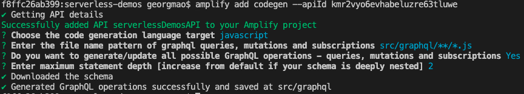

## Step 0: Prereqs

1. [Install Node](https://nodejs.org/en/download/) for your OS. Use Node 10 or newer.
2. Install npx for Node. npx is a package runner for npm. Recent versions of node will include npx. Check by running `npx` in your command prompt.

```
npm install -g npx (sudo if necessary)
```
3. Install the Amplify CLI

```
npm install -g @aws-amplify/cli (sudo if necessary)
```

4. Configure the Amplify CLI. Open a command prompt and type `amplify configure`. Follow the instructions.

This step creates an IAM user that Amplify will use to execute all management/deployment commands.

## Step 1: Install React dependencies

This step will create a top level folder for your project. The folder will be called 'serverless-demos'. 
Make sure you execute these commands from a directory you wish to use as your workspace area. For example: (/Users/georgemao/workspace).

1. Bootstrap your React project

```
npx create-react-app serverless-demos
```

2. Install all React dependencies

First cd into your project folder:

```
cd serverless-demos
npm install --save aws-amplify aws-amplify-react aws-appsync graphql-tag react-router-dom semantic-ui-react chart.js react-chartjs-2
```

## Step 2: Deploy the backend (Cognito IDP, Appsync API and Data tier) via CloudFormation

1. Open the CloudFormation console and deploy the provided file `deploy.yml`. There will be 3 parameters you must specify: `APIName`, `APIKeyExpiration`, `CognitoDomain`.

- APIName: This can be any string
- APIKeyExpiration: This is the expiration time for the API key. Must be a number. Enter an Epoch time that's at least 1 day in the future. Use https://www.epochconverter.com/
- CognitoDomain: This is the top level DNS you want Cognito to use to host your login UI. Must be a string.

2. When complete, goto the CloudFormation `outputs` tab and reference all of the values. You will use them later. You can test the Cognito hosted ui by pasting the `HostedUIURL` into your browser. You should see a Authentication screen.

## Step 3: Amplify to bootstrap your project && Auto Generate GraphQL queries from the schema

 **Make sure your command prompt is in your project directory (/workspace/serverless-demos).**

1. In your command prompt run `amplify init`. This will run through a series of questions. Make sure you use the following values:

- Visual Studio Code
- javascript
- react
- src


2. Auto generate the GraphQL queries from the deployed Schema. Accept all defaults.

```
amplify add codegen --apiId [AppSyncApiId from the outputs or from the Appsync console]
```



You should now have a new folder in your project folder `src/graphql` and a new file `src/aws-exports.js`. If you are missing the `aws-exports.js` file, you can download it from your AppSync console. Just select your API, switch to Javscript, and Download the config.

## Step 4: Deploy the React UI components

1. Setup the React Components. From the provided Source, copy the /Components folder to your local `src/Components`
2. Setup the React Routes. Copy the /Routes folder to your local `src/Routes`
3. Setup the base app files. Copy all JS and JSX files from /src to your local `src` folder

- index.js
- main.jsx

4. Setup all of the public static files. Copy the following from the provided source:
- /public/index.html
- /public/images/

> You will need to update your applicataion code to point to the Cognito deployment. Open `main.jsx` and on line: 42-46. Replace `region`, `userPoolId` and `userPoolWebClientId` with your values from the Cloudformation outputs

## Step 5: Test

You can run any React application locally (in dev mode) with the `npm start` command. This will deploy & host your application to `https://localhost:3000`

## Step 6: Build

When you are ready to deploy your application, React requires a build process. This minifies and compiles your code. Run `npm run build`. 

You should now have a `build` folder. 

## Step 7: Deploy

At this point you have two options:

1. You can use Amplify to deploy your app for you. Just run `amplify add hosting`. This creates an S3 bucket.
2. Manually deploy the contents of the `build` folder to a S3 bucket. Enable website hosting.

## Step 8: Optional. Add CloudFront CDN.

CloudFront serves content faster and cheaper than S3. You can add create a CloudFront Distro and add your S3 bucket as an origin. 

> You will need to add a workaround for CloudFront to properly serve React/S3 applications. This is because React routes do not update the URL to an actual asset stored in S3. In your distribution settings, under the `Error pages` tab, `Create Custom Error Response`. Add a response for error code `404` and redirect it to `/index.html`. Then set the response code to `200 OK`.
